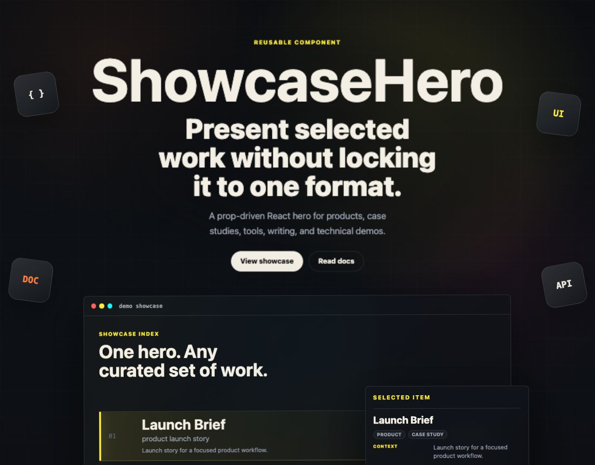

# showcase-hero

A polished, data-driven React hero component for presenting selected work, products, case studies, writing, demos, or technical references.

`@petesmithofficial/showcase-hero` exports a typed `ShowcaseHero` component with a responsive layout, optional action links, floating orbit labels, and an interactive workbench for highlighting selected items.



## Features

- Typed React API with first-class TypeScript declarations.
- Data-driven content model for hero copy, calls to action, orbit labels, and selected work.
- Interactive workbench with pointer tracking, keyboard navigation, hover previews, and touch support.
- Configurable workbench tilt through `workbench.motion.maxTiltDegrees`.
- Scoped stylesheet with responsive layout and reduced-motion handling.
- Packaged for normal npm installation with CSS and documentation assets included.

## Install

```sh
npm install @petesmithofficial/showcase-hero
```

## Quick Start

Import the component and stylesheet from the package:

```tsx
import { ShowcaseHero, type ShowcaseHeroProps } from "@petesmithofficial/showcase-hero";
import "@petesmithofficial/showcase-hero/styles.css";

const hero: ShowcaseHeroProps = {
  actions: [
    { href: "#work", label: "View work" },
    { href: "/contact", label: "Contact", variant: "secondary" },
  ],
  content: {
    detail: "A focused introduction for selected work, product stories, and technical notes.",
    eyebrow: "Portfolio system",
    name: "ShowcaseHero",
    statement: "A flexible hero for public work.",
  },
  orbitTiles: [{ label: "UI" }, { label: "API" }, { label: "DOC" }],
  workbench: {
    caption: "One hero. Any curated set of work.",
    id: "work",
    items: [
      {
        destination: {
          href: "https://example.com/case-study",
          label: "Open case study ->",
          rel: "noopener noreferrer",
          target: "_blank",
          type: "case study",
        },
        details: [
          { label: "Context", value: "Launch story for a focused product workflow." },
          { label: "Format", value: "Outcome, screenshots, technical notes, and next steps." },
        ],
        metadata: ["product", "case study"],
        name: "Launch Brief",
        signal: "case study",
        slug: "launch-brief",
        summary: "product launch story",
      },
    ],
    listLabel: "Selectable showcase items",
    motion: { maxTiltDegrees: 6 },
    selectedLabel: "selected item",
    tags: ["typed props", "responsive", "themeable"],
    title: "selected work",
  },
};

export function Page() {
  return <ShowcaseHero {...hero} />;
}
```

## API

`ShowcaseHero` accepts a single `ShowcaseHeroProps` object.

| Prop | Type | Description |
| --- | --- | --- |
| `content` | `ShowcaseHeroContent` | Required hero copy: `eyebrow`, `name`, `statement`, and `detail`. |
| `actions` | `ShowcaseHeroAction[]` | Optional primary and secondary links displayed below the hero copy. |
| `orbitTiles` | `ShowcaseHeroOrbitTile[]` | Optional floating labels. The first four tiles receive default positions. |
| `workbench` | `ShowcaseHeroWorkbench` | Optional interactive panel for selectable showcase items. |
| `className` | `string` | Optional class added to the root section. |
| `id` | `string` | Optional root section id. |
| `titleId` | `string` | Optional id for the hero heading used by `aria-labelledby`. |

### Workbench Items

Each workbench item is intentionally neutral, so it can represent a case study, project, article, demo, download, product area, or reference.

| Field | Description |
| --- | --- |
| `name` | Visible item title. |
| `summary` | Short row description. |
| `signal` | Compact category or status label. |
| `slug` | Stable caller-owned identifier. |
| `details` | Optional label/value rows for the selected item panel. |
| `metadata` | Optional chips such as technology, medium, status, or audience. |
| `destination` | Optional link with caller-controlled label, target, rel, aria label, and type. |

## Motion

The workbench follows the pointer using viewport-based rotation and subtle translation. By default, the maximum Y-axis tilt is `8deg`.

Use `workbench.motion.maxTiltDegrees` to tune the rotation intensity:

```tsx
const hero: ShowcaseHeroProps = {
  content,
  workbench: {
    caption: "Selected work",
    items,
    motion: { maxTiltDegrees: 5 },
    title: "workbench",
  },
};
```

This option changes only the rotation amplitude. Pointer tracking, translation, hover behavior, touch behavior, and timing remain unchanged.

## Styling

Import the packaged stylesheet once in your app:

```tsx
import "@petesmithofficial/showcase-hero/styles.css";
```

The stylesheet is scoped under `.showcase-hero`. You can override colors, spacing, shadows, and panel treatments with CSS custom properties on the component root:

```css
.showcase-hero {
  --hero-bg: #111318;
  --hero-accent: #f4c95d;
  --hero-panel: rgba(255, 255, 255, 0.08);
}
```

## Accessibility

- The root section uses `aria-labelledby` for the hero heading.
- The workbench list supports pointer selection and keyboard navigation with `ArrowUp`, `ArrowDown`, `Home`, and `End`.
- Destination links accept caller-provided `ariaLabel`, `target`, and `rel` values.
- Motion is disabled for users who request reduced motion.

## Development

```sh
make dev
make verify
```

The local demo runs on [http://localhost:8788](http://localhost:8788).

`make verify` runs TypeScript checks, the production build, and package contract checks.

## License

MIT. See [LICENSE](LICENSE).
